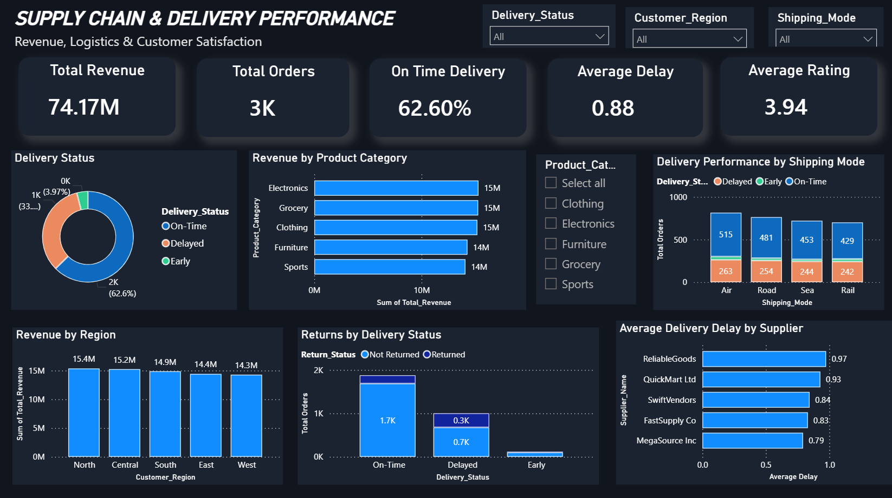

📦 Supply Chain & Delivery Performance Analysis
📌 Project Overview

The Supply Chain & Delivery Performance Analysis project focuses on analyzing order, delivery, revenue, supplier, and customer satisfaction data to identify operational bottlenecks and understand how delivery performance affects business outcomes.

The project analyzes 3,000+ orders generating ₹74.17M in revenue and uses Python and Power BI to transform raw operational data into meaningful business insights.

The main goal was to answer questions such as:

How efficiently are orders being delivered?
What percentage of orders are delayed?
Which product categories generate the most revenue?
Which regions contribute the most revenue?
Which shipping modes experience more delivery issues?
Which suppliers have higher average delivery delays?
Is poor delivery performance associated with customer returns?
How can the company improve its delivery operations?
🎯 Business Problem

A supply chain company receives thousands of orders across different regions, suppliers, products, warehouses, and shipping modes.

However, raw order data does not immediately show where operational problems are occurring.

The business needs to understand:

Delivery delays
On-time delivery performance
Supplier performance
Shipping-mode performance
Revenue contribution by product and region
Customer returns
Customer satisfaction

Without proper analysis, management may find it difficult to identify the major bottlenecks and decide where operational improvements are required.

Problem Statement

Analyze supply chain and delivery data to identify delivery bottlenecks, revenue drivers, supplier performance issues, and relationships between delivery performance and customer outcomes, and present the findings through an interactive Power BI dashboard.

🎯 Project Objectives

The major objectives of this project were:

Analyze overall delivery performance.
Measure on-time, delayed, and early deliveries.
Identify revenue-generating product categories.
Compare revenue performance across regions.
Analyze delivery performance across shipping modes.
Evaluate supplier delivery performance.
Analyze returns based on delivery status.
Understand customer satisfaction using ratings.
Build an interactive dashboard for business users.
Provide actionable recommendations for improving supply chain performance.
📊 Dataset

The dataset contains 3,000+ order records with information related to customers, products, suppliers, delivery performance, revenue, returns, and customer ratings.

Important Columns
Category	Columns
Order Information	Order_ID, Order_Date, Customer_ID
Customer	Customer_Region, Customer_City, Customer_Rating
Product	Product_Category, Product_Name
Supplier	Supplier_Name
Logistics	Shipping_Mode, Warehouse_Location
Order Metrics	Quantity, Unit_Price, Total_Revenue
Delivery	Expected_Delivery_Days, Actual_Delivery_Days, Delay_Days, Delivery_Status
Returns	Return_Status
🛠️ Tools & Technologies
Python
Pandas
NumPy
Matplotlib
Business Intelligence
Power BI
DAX
Interactive filters and KPI cards
Data Analysis
Data Cleaning
Exploratory Data Analysis (EDA)
Aggregation
KPI Analysis
Business Insight Generation
Version Control
Git
GitHub
🔄 Project Methodology

The project followed an end-to-end data analysis workflow:

Raw Dataset
     ↓
Data Cleaning
     ↓
Data Validation
     ↓
Exploratory Data Analysis
     ↓
Feature/KPI Analysis
     ↓
Business Analysis
     ↓
Power BI Dashboard
     ↓
Insights
     ↓
Business Recommendations
🧹 Data Cleaning & Preparation

The raw dataset was first inspected to understand its structure and identify potential data-quality issues.

The preparation process included:

Checking missing values
Checking duplicate records
Validating data types
Checking numerical columns for consistency
Validating delivery-related fields
Checking categorical values
Preparing the dataset for analysis and visualization

The delivery-related fields were particularly important because they were used to evaluate whether orders were delivered on time, early, or late.

⚙️ Analytical Approach

I analyzed the dataset from multiple business perspectives.

1. Delivery Performance

I analyzed:

On-Time deliveries
Delayed deliveries
Early deliveries
Average delivery delay
2. Revenue Analysis

I analyzed revenue by:

Product Category
Customer Region
3. Logistics Analysis

I compared delivery performance across:

Shipping Modes
Suppliers
4. Customer Outcome Analysis

I analyzed:

Returns by delivery status
Customer ratings
Delivery performance in relation to customer outcomes
📊 Power BI Dashboard

The final analysis was presented through an interactive Power BI dashboard.

Dashboard Preview

📊 Power BI Dashboard

The dashboard provides an interactive view of revenue, delivery performance, logistics performance, supplier delays, and customer outcomes.

Dashboard Features

The dashboard includes:

Total Revenue
Total Orders
On-Time Delivery Rate
Average Delivery Delay
Average Customer Rating
Delivery Status Distribution
Revenue by Product Category
Delivery Performance by Shipping Mode
Revenue by Region
Returns by Delivery Status
Average Delivery Delay by Supplier

Interactive filters allow users to analyze the dashboard based on:

Delivery Status
Customer Region
Shipping Mode
Product Category
📈 Key KPIs
KPI	Result
Total Orders	3K+
Total Revenue	₹74.17M
On-Time Delivery	62.60%
Average Delivery Delay	0.88 days
Average Customer Rating	3.94 / 5
🔍 Key Insights
1. Delivery Performance

The dashboard shows that 62.60% of orders were delivered on time.

At the same time, approximately one-third of orders were delayed, making delivery performance one of the major areas requiring operational attention.

This indicates that improving delivery reliability could be an important opportunity for the business.

2. Revenue by Product Category

The analysis shows that Electronics, Grocery, and Clothing are among the strongest revenue-generating categories, each contributing approximately ₹15M.

Furniture and Sports also contribute significant revenue at approximately ₹14M each.

Business Interpretation

The company should maintain product availability and supply reliability for high-revenue categories because disruptions in these categories could have a larger impact on overall revenue.

3. Revenue by Region

The dashboard shows relatively strong revenue contribution across all five regions.

North — ₹15.4M
Central — ₹15.2M
South — ₹14.9M
East — ₹14.4M
West — ₹14.3M
Business Interpretation

The revenue distribution is relatively balanced, meaning the business is not completely dependent on one geographical region.

The North and Central regions are currently the strongest revenue contributors.

4. Shipping Mode Performance

The dashboard compares delivery performance across:

Air
Road
Sea
Rail

Air has the highest number of orders in the displayed comparison, while each shipping mode shows a combination of on-time, delayed, and early deliveries.

Business Interpretation

Shipping mode performance should be monitored not only based on order volume but also on delay rates and operational cost.

The business could investigate whether higher-volume modes are also responsible for a disproportionate number of delays.

5. Supplier Performance

The supplier analysis shows differences in average delivery delay.

The displayed suppliers include:

ReliableGoods — 0.97 days
QuickMart Ltd — 0.93 days
SwiftVendors — 0.84 days
FastSupply Co — 0.83 days
MegaSource Inc — 0.79 days
Business Interpretation

The suppliers with higher average delays should be investigated further.

The company could review:

Supplier lead times
Warehouse processing
Transportation arrangements
Order volumes
Delivery routes

to identify the underlying cause of delays.

6. Returns and Delivery Performance

The dashboard compares returned and non-returned orders across delivery statuses.

This analysis helps the business investigate whether delivery problems are associated with customer returns.

Business Interpretation

If delayed orders show a higher proportion of returns than on-time orders, improving delivery reliability could potentially help reduce returns and improve customer satisfaction.

7. Customer Satisfaction

The overall average customer rating is 3.94/5.

This indicates that customer experience is reasonably positive overall, but there is still room to improve.

Delivery performance can be one of the operational factors influencing customer experience, so delivery delays and customer ratings should be monitored together.

💡 Business Recommendations

Based on the analysis, the following actions could be considered:

1. Reduce Delivery Delays

Investigate the major causes of delayed orders and focus on reducing avoidable delays.

2. Improve Supplier Monitoring

Create supplier-level performance tracking using:

Average delay
On-time delivery rate
Return rate
Order volume
3. Optimize Shipping Modes

Compare shipping modes based on:

Delivery speed
Delay rate
Cost
Order volume

and select the appropriate mode based on business requirements.

4. Protect High-Revenue Categories

Ensure sufficient inventory and reliable logistics for high-revenue product categories such as Electronics, Grocery, and Clothing.

5. Monitor Returns

Track returns against delivery performance to determine whether delivery issues are contributing to customer dissatisfaction.

6. Improve Customer Experience

Monitor customer ratings alongside delivery performance to identify operational factors affecting customer satisfaction.
